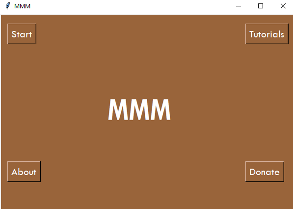
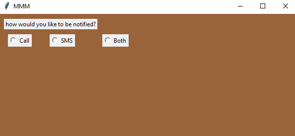
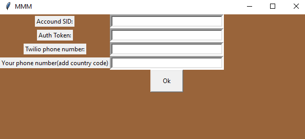
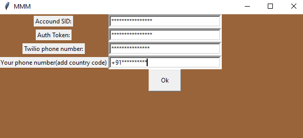
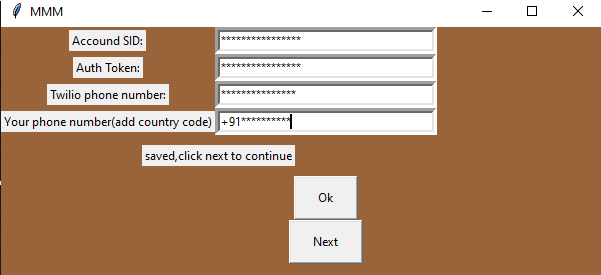
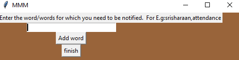

# MMM-Message My Mentions 

Are you a sleepyhead?\
DO you often fall asleep during your online classes?\
Are you so busy during the online classes that you won't be able to attend it?


so you want to be notified when or if your name is being mentioned in the meeting
MMM has the solution for you!!

You will be notified when your name is being mentioned in any app that is running in the system.
This app is able to recognise the audio playing from the speaker of the computer and it processes the audio to match to the name given
by the user.
If the condittion matches, this app then triggers twilio to send message to your phone stating that you name was mentioned

## Download link
You can download the MMM setup file [here](https://github.com/srisharaan/mmm/releases/tag/v1.0.4 "MMM-Message My Mentions")

<https://github.com/srisharaan/mmm/releases/tag/v1.0.4>


***CONTACT:***

  *Telegram*

    ``t.me/srisharaan``

   *Instagram*

    instagram.com/srisharaan
    check my instagram profile [here](instagram.com/srisharaan)


***INSTRUCTIONS***

1. Setting->system->sound
2. select ``sound control panel``


3.``right click->show disabled device``


4. Select Microphone as default communication device and stereo mix as default device
5. this step is essential to record audio 


6.goto ``twilio.com/try-twilio``


7. open ``mmm.exe``` 



8. choose your desired option\
  Start-To start using MMMM\
  About-To know about the app and the developer\
  Tutorial-To learn the usage of the application\
  Donate-To donate to the developer.


9.Selece how you need to be notified




10 The following are one time process


11Enter your twilio account details




12click ok to save your details




13.click next to proceed further




14.Enter the hot work for which you must be notified




15.click Add word to add another word and finish to start the app


***NOTES***

1.Make sure to fill the details without any mistakes


2.Don't delete any files inside the folder


3.The script is working but you just can't expect 100% accuracy


4.The results of speech recognition is fetched from google


5.The details are stored locally in a database which are asked during the startup of the application


6.Enter the phone number with the country code


7.Make sure you have a stable internet connection
